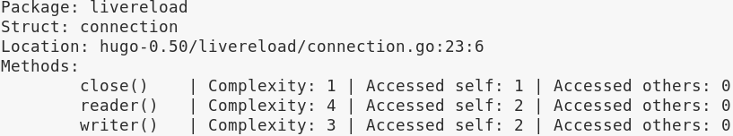

# GodExpo

GodExpo ia God Struct smell detector for Golang.

## Getting Started

These instructions will get you a copy of the project up and running on your local machine for development and testing purposes.

### Prerequisites

Golang must be installed (>= v1.10). To install golang in ubuntu run-

```
sudo apt-get install golang
```

### Compiling

At first, download the project-

```
git clone https://github.com/rafed123/GodExpo
```

Navigate to the source files

```
cd GodExpo/app/
```

Build the project with

```
./build.sh
```

or

```
go build -o godExpo
```

## Running the Tool

You can now run the tool on go projects to-

* Show struct summary
* Find God Structs
* Show evolution of god structs
* Set custom thresholds for metric calculations

### 1. Show Struct Summary
```
./godExpo -f path_to_file.go
```

Sample output-



### 2. Find God Structs
```
./godExpo -d path_to_directory/
```

Sample output-


### 3. Show evolution of god structs
```
./godExpo -e path_to_directory/
```
* Directory should have different versions of a project

Sample output-


### 4. Set Custom Thresholds for Metric Calculations

Set custom WMC
```
./godExpo -wmc 50 -d path_to_directory/
```

Set custom ATFD
```
./godExpo -atfd 10 -d path_to_directory/
```

Set custom TCC
```
./godExpo -tcc 0.5 -d path_to_directory/
```

## Authors

* [**Rafed Muhammad Yasir**](https://github.com/rafed123)
* [**Moumita Asad**](https://github.com/mou23)


## License

This project is licensed under the MIT License - see the [LICENSE.md](LICENSE.md) file for details.

